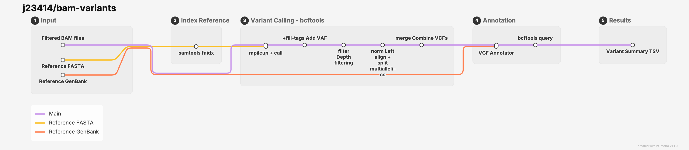

# bam-variants

A modular workflow for generating a table of variants from alignment information.



## Usage

```bash
# Run with defaults
nextflow run j23414/bam-variants \
  --bam [path/*.bam] \
  --samplesheet [path/bam_samplesheet.csv] \
  --reference_fasta "reference.fasta" \
  --reference_gb "reference.gb" \
  -profile stjude

# Specify more details
nextflow run j23414/bam-variants \
  --bam [path/*.bam] \
  --samplesheet [path/bam_samplesheet.csv] \
  --reference_fasta "reference.fasta" \
  --reference_gb "reference.gb" \
  --outdir "variant-results" \
  --depth 10000 \
  --min_depth 20 \
  --bcftools_mpileup_args "--max-depth 10000 --max-idepth 10000 --per-sample-mF --count-orphans --no-BAQ --min-BQ 13 --min-MQ 30 --annotate AD,ADF,ADR,DP,SP" \
  --bcftools_call_args "-mv --prior-freqs AN,AC, -A --variants-only --keep-alts --keep-masked-ref" \
  --bcftools_filter_args "-i 'FORMAT/DP>=20' --output-type z --write-index=tbi" \
  --bcftools_norm_args "--multiallelics -any --check-ref s --output-type z --write-index=tbi" \
  -profile stjude
```

Example Nextflow progress messages

```bash

 N E X T F L O W   ~  version 26.04.4

Launching `bam-variants/main.nf` [prickly_agnesi] revision: a282eab8d9
executor >  lsf (168)
[a6/052f67] SAM…LS_FAIDX (reference.fasta) | 1 of 1 ✔
[bf/bf291b] BCF…ILEUP (3425677_785624_S94) | 41 of 41 ✔
[df/5df350] BCF…LTAGS (3425677_785624_S94) | 41 of 41 ✔
[1e/a39123] BCF…R (3425719_785666_S133_20) | 41 of 41 ✔
[ed/05d14f] BCF…NORM (3425718_785665_S132) | 41 of 41 ✔
[fd/59a9cd] BCFTOOLS_MERGE (merged)        | 1 of 1 ✔
[44/d6e4ed] VCF_ANNOTATOR (annotate)       | 1 of 1 ✔
[c7/c0444e] BCFTOOLS_QUERY (1)             | 1 of 1 ✔
Completed at: 06-Aug-2026 09:32:28
Duration    : 3m 31s
CPU hours   : 0.1
Succeeded   : 168
```

Final variants in:

```bash
ls variant-results/sample_variants_results.tsv
```
